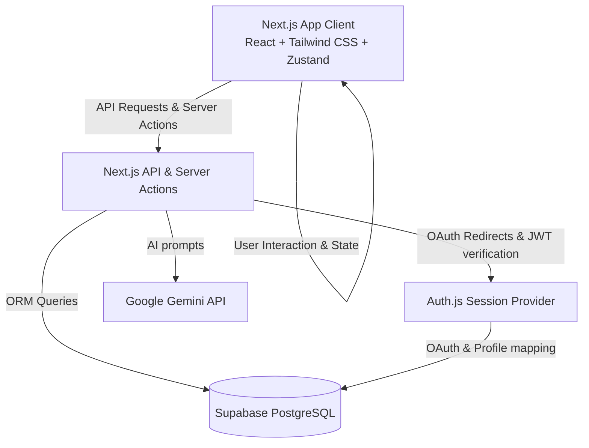
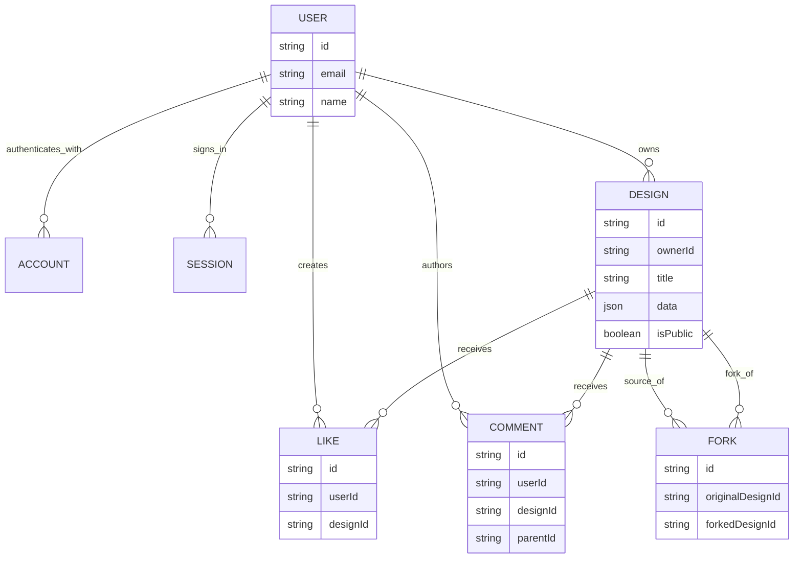
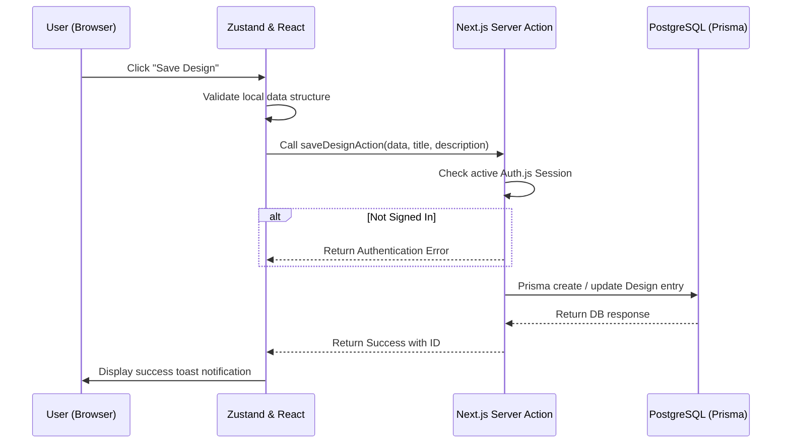

# System Architecture Overview

GitGraph Studio is a full-stack Next.js web application built with TypeScript, Prisma, and Supabase. This document describes the application architecture, system components, database schemas, and data flow.

---

## High-Level Architecture

GitGraph Studio uses Next.js (App Router) as its core framework. The editor UI operates as a fast, stateful client application (Single Page App style catch-all route `/[[...slug]]`) while utilizing Next.js API Routes and Server Actions for backend tasks, such as authentication checks, storage persistence, and community gallery logic.

---

## Key Technologies

- **Frontend Core**: React 19, Tailwind CSS v4, Motion (framer-motion).
- **State Management**: Zustand handles drawing coordinates, undo/redo buffers, and tool states.
- **Backend Infrastructure**: Next.js API Routes, Server Actions, Route Middleware.
- **Database & ORM**: PostgreSQL hosted on Supabase, accessed via Prisma ORM.
- **Authentication**: Auth.js (v5) supporting GitHub, Google, and Email/Password credentials.
- **Generative AI**: Google Gemini API via `@google/genai` library (used for converting text prompts into contribution grid patterns).

---

## Core Components

### 1. The Interactive Visual Editor (`src/App.tsx`)
The centerpiece of the application is a responsive canvas representing the standard GitHub contribution grid (53 columns by 7 rows, totaling 371 pixels).
- **Drawing Grid**: Implemented using pure CSS grid layouts and standard React state callbacks.
- **Zustand Store**: Maintains grid state array `[53 * 7]`, tool selection (Draw, Erase, Fill, Stamp), current color intensity level (0 to 4), and undo/redo stacks.
- **Text tool**: Projects font pixel matrices onto grid cells (located in `src/utils/pixelFonts.ts`).
- **Image tool**: Resizes, gray-scales, and maps image inputs into intensity levels (0 to 4).

### 2. Gallery & Remix Engine (`app/api/gallery`)
Allows users to browse public contribution designs, submit their own to the gallery, and fork/remix designs.
- **Save Action**: Stores canvas designs as serialized JSON grids in the Database.
- **Fork Action**: Clones an existing design, assigns ownership to the current user, and increments the fork counters.
- **SVG Rendering Engine**: Dynamically generates visual contribution grid previews directly on the server to render as standard SVGs inside cards, preventing layout shifts.

### 3. Database Schema (`prisma/schema.prisma`)
The PostgreSQL database consists of several core tables to handle users, profiles, designs, interactions, and session logs:
- **`User` / `Account` / `Session`**: Auth.js tables mapping social identities.
- **`Design`**: Main entity representing a contribution graph design. Contains metadata (`title`, `description`, `isPublic`), the serialized pixel grid representation (`data` field as JSON), and counters for views, forks, and likes.
- **`Fork`**: Tracks relationships between original and cloned designs.
- **`Like`**: Captures user liking activity.
- **`Comment`**: Threaded comments under community gallery items.

#### Database Relationship Diagram

The diagram focuses on ownership and gallery interactions. Auth.js support tables
(`Account` and `Session`) are shown only at relationship level so the reader can
see where identity joins the application domain without overwhelming the main
design-sharing flow.

---

## Data Flows

### Saving a Design

### Loading & Remixing a Design

1. User visits `/gallery` or click "Remix".
2. Next.js fetches the design details from the PostgreSQL database using Prisma.
3. The page loads and reads the JSON array representation of the contribution grid.
4. The React application populates the Zustand drawing store state with the fetched grid data.
5. The visual editor renders the pixels on the canvas instantly.
