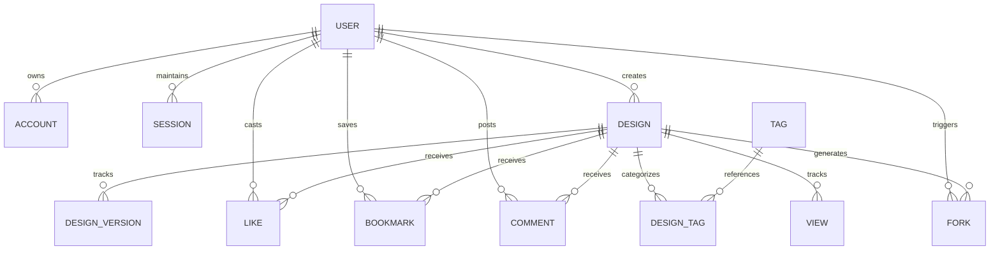

# GitGraph Studio: Database Documentation

This document describes the PostgreSQL database schema, data models, relations, indexing strategies, and performance configurations.

## Schema Overview

GitGraph Studio utilizes **Prisma ORM** to coordinate schemas with an **Azure Database for PostgreSQL Flexible Server**. The data models support authentication adapters (Auth.js) and application components.

The schema file is located at [prisma/schema.prisma](file:///c:/Users/nanda/gitgraph.studio/prisma/schema.prisma).

---

## 1. Data Models

### Authentication Models
- **`User`**: Core user record. Stores GitHub details (username, name, email, avatar image, bio).
- **`Account`**: OAuth provider connection details (access tokens, refresh tokens, scopes, credentials).
- **`Session`**: Active login sessions.
- **`VerificationToken`**: Standard token validation record.

### Application Models
- **`Design`**: Main artifact record. Stores:
  - `title`, `description`
  - `graphData` (JSON pixel matrix coordinates)
  - `visibility` (DRAFT, PUBLIC)
  - Relations to parent (for forks) and creator.
- **`DesignVersion`**: Version history logs saving incremental pixel changes for recovery.
- **`Like`**: Toggles user likes.
- **`Bookmark`**: Saved design catalog joins.
- **`Fork`**: Tracks fork relationships.
- **`Comment`**: Hierarchical discussion logs. Connects replies to parents using a `parentId` recursive self-relation.
- **`Tag` / `DesignTag`**: Join models managing categorizations.
- **`View`**: Design view counters.

---

## 2. Relationships & Cascade Rules

- **User Deletion**:
  - `onDelete: Cascade` is applied to all child relations of `User`. Deleting a user wipes their `Account`, `Session`, `Design` creations, `Like` entries, `Bookmark` catalog, `Comment` logs, and `Fork` creations.
- **Design Deletion**:
  - `onDelete: Cascade` wipes versions (`DesignVersion`), likes (`Like`), bookmarks (`Bookmark`), comments (`Comment`), analytics (`View`), and tag associations (`DesignTag`).
  - Fork parent links are preserved as nullable: `parentId String?` with `onDelete: SetNull`. This ensures that even if the original parent design is deleted, children fork projects are preserved and can still be edited.
- **Comment Deletion**:
  - Threaded comment replies use `onDelete: Cascade`. Deleting a comment recursively deletes its replies tree.

---

## 3. Indexes & Constraints

To optimize search and query response times in PostgreSQL, we declare explicit indexing columns:
- **`Account`**: Composite unique index `@@unique([provider, providerAccountId])` and query index on `userId`.
- **`Session`**: Unique index on `sessionToken` and query index on `userId`.
- **`Design`**: Query indexes on `creatorId` and `parentId` for quick dashboard loads and fork history traces.
- **`Like` / `Bookmark`**: Composite primary keys `@@id([userId, designId])` to ensure single-cast uniqueness per user, and separate query indexes on `designId` and `userId`.
- **`Fork`**: Query indexes on `parentId`, `childId`, and `userId`.
- **`Comment`**: Query indexes on `userId`, `designId`, and `parentId`.
- **`DesignTag`**: Composite primary key `@@id([designId, tagId])` to prevent duplicate tag attachments.
- **`View`**: Index on `designId` to calculate fast counts.
